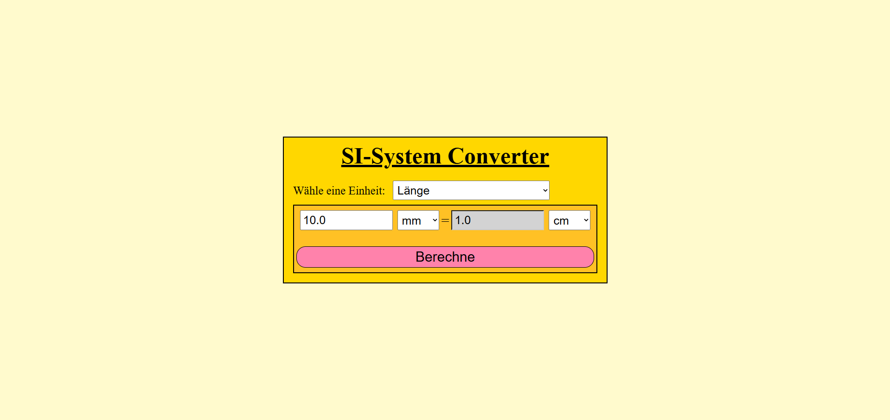
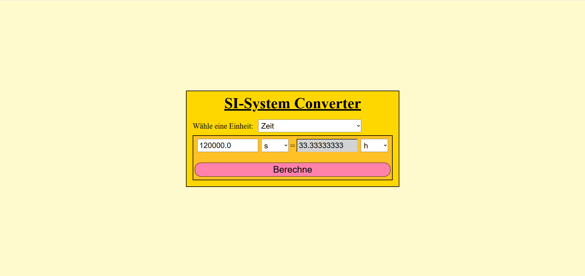
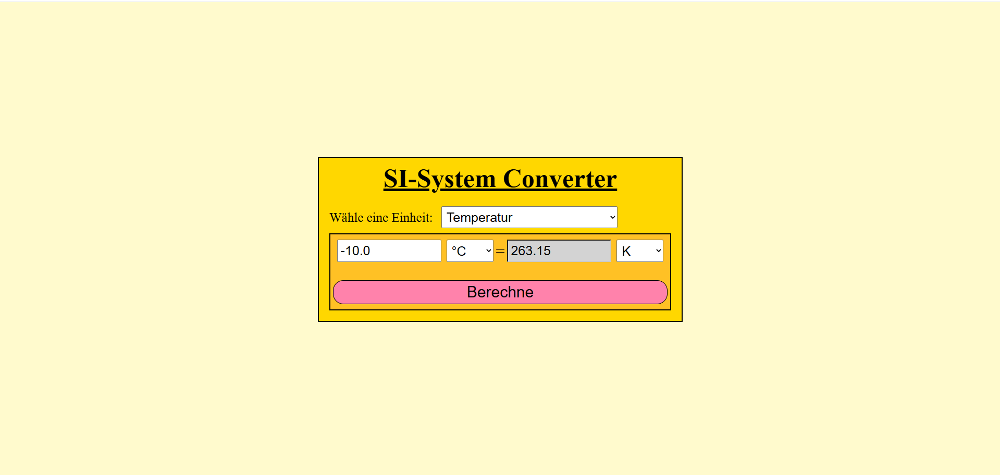

# SIUnitConverter
A web application for converting units of the seven SI base quantities.

## Motivation
I wanted to further practice my skills in Java Spring Boot and gain more experience with web development. Since the university semester was about to start, I decided to develop a smaller project that could be completed within a shorter period of time.

The main focus of this project was the **frontend**, particularly **CSS and JavaScript**. I wanted to improve my understanding of creating an interactive web interface and working with **Flexbox layouts**.

I also wanted to revisit the fundamentals of **JUnit testing** and practice writing unit tests for the application's conversion logic.

The project therefore combines a small Spring Boot backend with a Thymeleaf-based frontend, while keeping the overall scope intentionally limited.

## Features
### Unit Conversion
The application supports all seven SI base quantities:
- Length
- Mass
- Time
- Electric current
- Temperature
- Amount of substance
- Luminous intensity

The available units are dynamically loaded based on the selected SI base quantity.

The application provides:

- Selection of an SI base quantity
- Selection of source and target units
- Conversion of numerical values
- Dynamic loading of available units
- Input restrictions depending on the selected base quantity

## Technologies
### Backend
- Java
- Spring Boot
- Spring MVC

### Frontend
- Thymeleaf
- HTML
- CSS
- JavaScript

### Testing
- JUnit

### Tools
- Eclipse
- Git
- GitHub

## Architecure
The application is structured into several components according to their responsibilities.

The main components are:

- **Controller** – handles HTTP requests and communicates with the frontend
- **Service** – contains the unit conversion logic
- **Model** – represents SI base quantities and their corresponding units
- **Constants** – contains constants used throughout the application

The **IndexController** handles the requests for the main page and provides the available units for the selected SI base quantity.

The **UnitConverterService** contains the central conversion logic. When converting between different units, the source value is first converted to the corresponding base unit and then converted from the base unit to the target unit.

The SI units are represented using interfaces and enums. Common conversion behaviour is defined through the **SIUnit** interface, while linear units share additional functionality through the **LinearUnit** interface.

For readability, some unit enums are shown in simplified form in the class diagram. The **MassUnits** and **TemperatureUnits** enums are shown in greater detail to illustrate their structure and conversion logic.

## Conversion Logic
The conversion is generally performed in two steps:
1. Convert the input value from the source unit to the corresponding base unit.
2. Convert the base-unit value to the selected target unit.

For example, when converting between two length units, the value is first converted to **metres** and then from metres to the selected target unit.

This approach allows conversions between different units without having to implement a separate conversion for every possible pair of units.

The unit enums for the linear SI base quantities implement the **LinearUnit** interface, which extends **SIUnit** and provides a common conversion factor.

**TemperatureUnits** implements **SIUnit** directly because temperature conversions require both a conversion factor and an offset.

## Testing
One of the goals of the project was to revisit and practice **JUnit unit testing**.

Each of the seven SI base quantities has its own test class. The tests focus on the **UnitConverterService** and verify conversions between different units.

For each base quantity, three typical conversion cases are tested:
- Conversion to a larger unit
- Conversion to a smaller unit
- Conversion between equal units

For example, the electric current tests include:
- 1000 mA = 0.001 kA
- 1 A = 1000 mA
- 1 mA = 1 mA

This test structure is applied to all seven SI base quantities.

The tests use **JUnit** only. No mocking framework such as Mockito is required because the **UnitConverterService** does not depend on external components such as repositories or other services.

## Version Control
Git and GitHub were used during the development process.

The project was developed using two feature branches:
- **feature/units** – implementation of the unit classes and initial frontend development
- **feature/convert** – implementation of the conversion service, completion of the frontend design and implementation of the tests

After the development was completed, both feature branches were merged and subsequently deleted.

The final version of the project is therefore contained in the main branch.

## Future Development

The project is considered complete in its current scope.

A possible future extension would be to add additional units to the existing SI base quantities. For example, additional length units such as **micrometres (µm)** could be added.

No database or other external data storage is required for the application, and extending the frontend is not currently planned.
